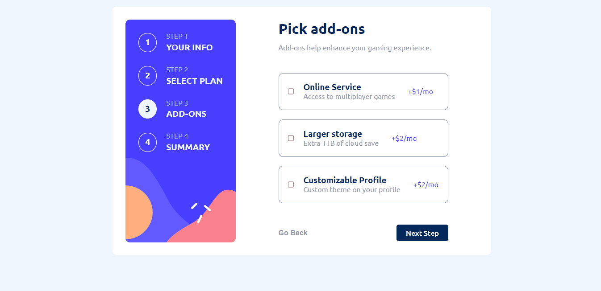
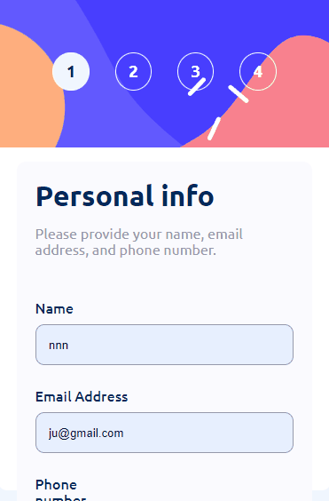

# Desafio Multistep Form - Frontend-Mentor

Este é um desafio de um formulário com múltiplos passos, proposto pelo site Frontend-Mentor.

## Tabela de Conteúdos

- [Visão Geral](#visão-geral)
    - [Imagens](#imagens)
    - [Link da página](#link)
- [Processo](#processo)
    - [Linguagens utilizadas](#linguagens-utilizadas)
    - [O que aprendi](#o-que-aprendi)
    - [Possíveis evoluções](#possíveis-evoluções)
- [Autor](#autor)

## Visão-geral

### Imagens

<br>

````
Versão de Desktop
````

   

<br>

````
Versão Mobile

````

 

### Link

- Página no GitHub Pages: <a href="https://julio-mansan2.github.io/multistep-form/">Clique aqui!</a>

## Processo

### Linguagens utilizadas

<br>

- Marcações semânticas de HTML5
- Propriedades de customização do CSS3
- Estruturas de JavaScript

<br>

### O que aprendi

<br>

- Criar um input toggle:

````html

<span class="span-toggle color-checked">Monthly</span>
<input type="checkbox" id="switch" /><label for="switch" class="label-switch">Toggle</label>
<span class="span-toggle">Yearly</span>

````
````css

#switch {
    height: 0;
    width: 0;
    display: none;
}

.label-switch {
    cursor: pointer;
    text-indent: -9999px;
    width: 3rem;
    height: 1.8rem;
    background: var(--marine-blue);
    display: block;
    border-radius: 6.25rem;
    position: relative;
    transition: 0.3s;
}

.label-switch:after {
    content: '';
    position: absolute;
    top: 0.3rem;
    left: 0.3rem;
    width: 1.2rem;
    height: 1.2rem;
    background: var(--alabaster);
    border-radius: 5.6rem;
    transition: 0.3s;
}

#switch:checked+.label-switch:after {
    left: calc(100% - 5px);
    transform: translateX(-100%);
}

````

- Mover a classe entre objetos:

````javascript

const inputToggle = document.getElementById('switch')
const arcadeInput = document.getElementById('arcade')
const advancedInput = document.getElementById('advanced')
const proInput = document.getElementById('pro')
const monthlyPrice = document.querySelectorAll('.monthly')
const yearlyPrice = document.querySelectorAll('.yearly')
const freeMessage = document.querySelectorAll('.free')
const spanToggle = document.querySelectorAll('.span-toggle')

inputToggle.addEventListener('click', function () {
    for (let i = 0; i < monthlyPrice.length; i++) {
        if (inputToggle.checked === true) {
            yearlyPrice[i].classList.add('selecionado')
            freeMessage[i].classList.add('selecionado')
            monthlyPrice[i].classList.remove('selecionado')
            spanToggle[0].classList.remove('color-checked')            
            spanToggle[1].classList.add('color-checked')
        } else if (inputToggle.checked === false) {
            yearlyPrice[i].classList.remove('selecionado')
            freeMessage[i].classList.remove('selecionado')
            monthlyPrice[i].classList.add('selecionado')
            spanToggle[0].classList.add('color-checked')            
            spanToggle[1].classList.remove('color-checked')
        }
    }
})

````
<br>

### Possíveis evoluções

<br>

- Códigos mais compactos;
- Utilizar funções mais compactas no JavaScript

<br>

## Autor

GitHub - <a href="https://github.com/julio-mansan2">julio-mansan2</a> <br>
Front-end Mentor - <a href="https://www.frontendmentor.io/profile/julio-mansan2">julio-mansan2</a> <br>
LinkedIn - <a href="https://www.linkedin.com/in/j%C3%BAlio-a-mansan-3415a7249/">Júlio A.</a> <br>